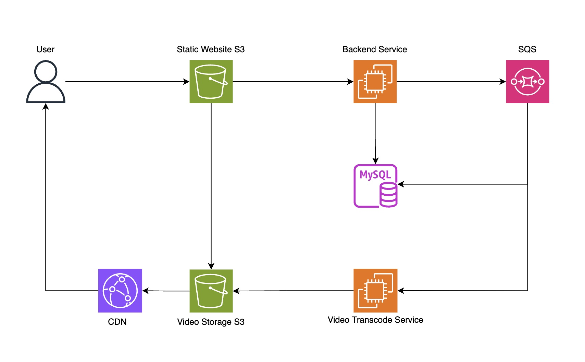

# Video Streaming Service Application

## Overview

This repository contains a video streaming service application built using React for the frontend, Express for the backend, and JavaScript for the video transcode service. The application leverages various AWS services to ensure scalability, reliability, and performance.

## Architecture Diagram



## Components

### Frontend

- **React**: The frontend is developed using React and is hosted as a static website on AWS S3.
- **CloudFront**: A CDN that serves the static website content globally, ensuring low latency and high transfer speeds.

### Backend

- **Express**: The backend is built using Express and is hosted on an EC2 instance.
- **MySQL**: A MySQL database is used to store user and video metadata.
- **S3 Signed URLs**: The backend generates signed URLs for secure video uploads.
- **Signed Cookies**: The backend generates signed cookies for secure video access.

### Video Upload and Transcoding

- **S3**: Used for storing uploaded videos and the frontend static website.
- **SQS**: S3 triggers an event to SQS when a video is uploaded.
- **Video Transcode Service**: A service (implemented in JavaScript) polls the SQS queue, processes the video into different resolutions, and stores the transcoded videos back to S3.

### Video Streaming

- **CloudFront**: Serves the video content using signed cookies to authenticate and authorize user access.

## Detailed Workflow

1. **User Interaction**
    - Users access the static website hosted on S3 via CloudFront.
    - Users can upload videos or watch videos from the frontend interface.

2. **Video Upload Process**
    - **Step 1**: The user requests a signed URL from the backend to upload a video.
    - **Step 2**: The backend (running on EC2) generates and returns a signed URL.
    - **Step 3**: The user uploads the video to the S3 bucket using the signed URL.
    - **Step 4**: S3 triggers an event to SQS once the video is uploaded.

3. **Video Transcoding**
    - **SQS Queue**: Receives events from S3.
    - **Transcode Service**: Polls the SQS queue, processes the video into different resolutions, and uploads the transcoded videos back to S3.

4. **Video Streaming**
    - **CloudFront Distribution**: Serves video content.
    - **Step 1**: The user requests to watch a video.
    - **Step 2**: The backend generates a signed cookie and returns it to the user.
    - **Step 3**: CloudFront checks the signed cookie.
    - **Step 4**: If the cookie is valid, CloudFront serves the video content.

## Technologies Used

- **Frontend**: React, AWS S3, AWS CloudFront
- **Backend**: Express, AWS EC2, AWS S3, AWS CloudFront, MySQL
- **Transcoding**: JavaScript, AWS S3, AWS SQS

## Setting Up

### Prerequisites

- AWS Account
- Node.js and npm installed
- MySQL database setup

### Frontend

1. Navigate to the `frontend` directory.
2. Install dependencies:
    ```bash
    npm install
    ```
3. Build the project:
    ```bash
    npm run build
    ```
4. Deploy the build directory to an S3 bucket configured to host a static website.

### Backend

1. Navigate to the `backend` directory.
2. Install dependencies:
    ```bash
    npm install
    ```
3. Configure environment variables for MySQL and AWS credentials.
4. Start the server:
    ```bash
    npm start
    ```

### Transcode Service

1. Navigate to the `transcode-service` directory.
2. Install dependencies:
    ```bash
    npm install
    ```
3. Configure environment variables for AWS credentials and SQS queue details.
4. Start the service:
    ```bash
    npm start
    ```

## Contributing

We welcome contributions! Please fork the repository and submit pull requests.

## License

This project is licensed under the MIT License.
